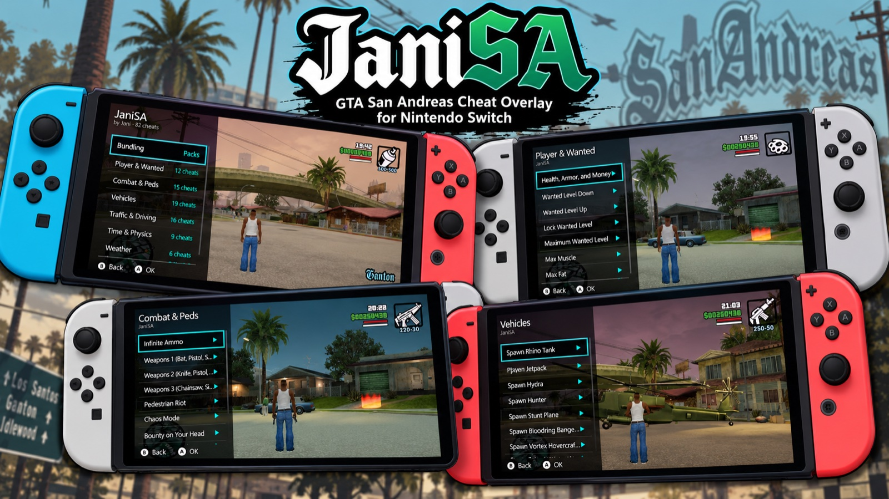
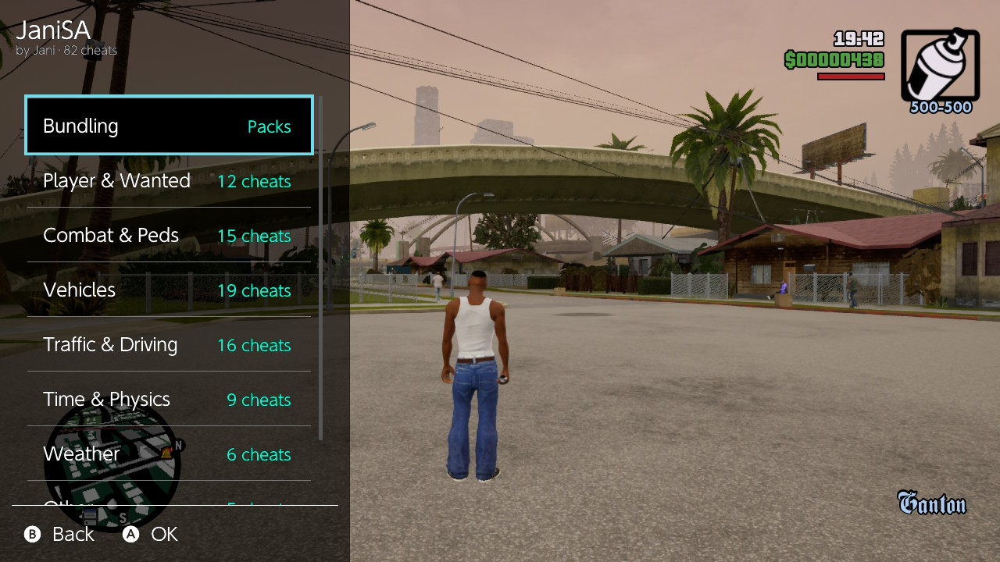
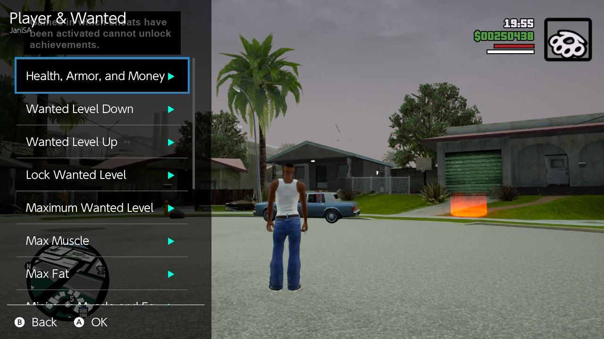
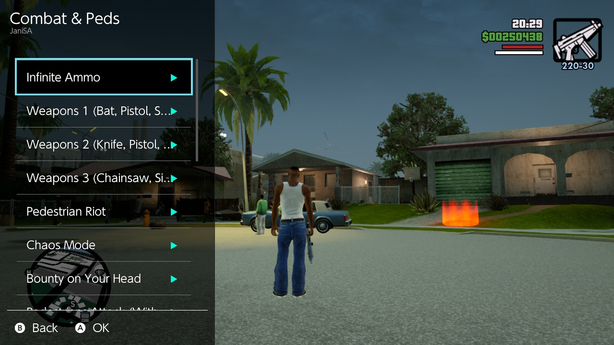
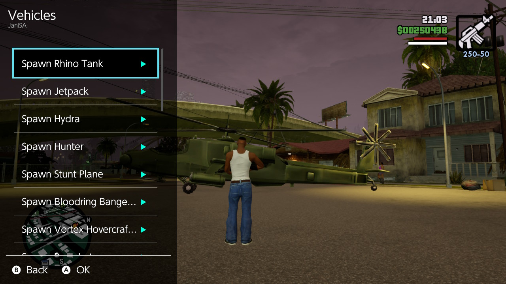
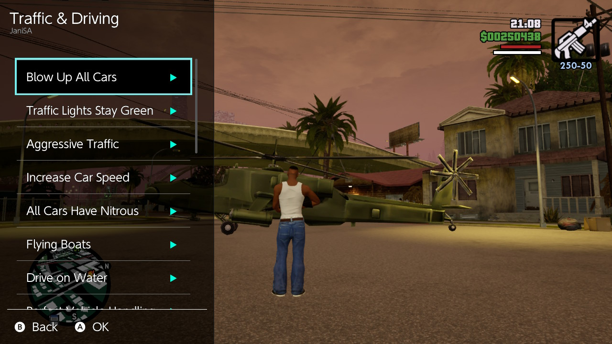
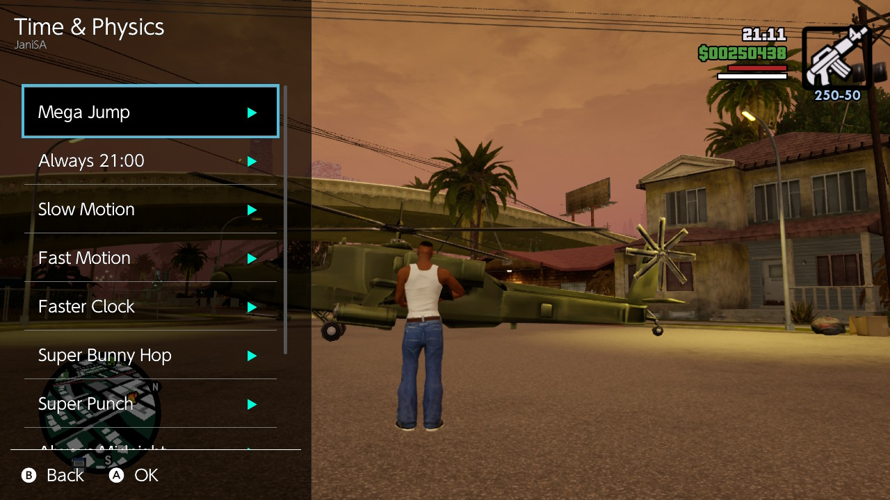
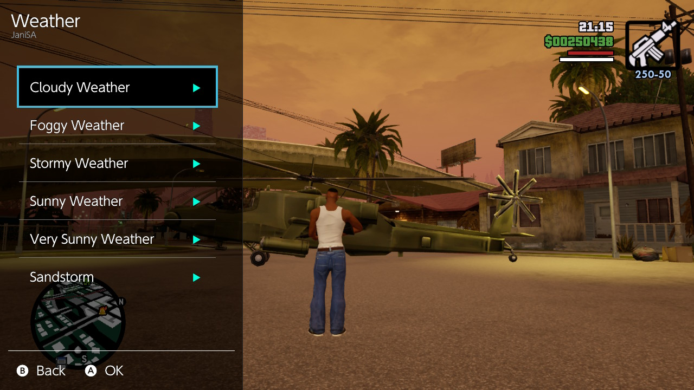
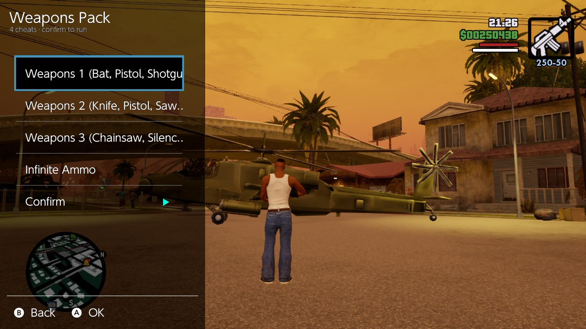

<div align="center">

# 🚗 JaniSA



### GTA San Andreas Cheat Overlay for Nintendo Switch

**Press a button. Get everything.**

JaniSA is a [Tesla](https://github.com/WerWolv/Tesla-Menu) overlay for **GTA San Andreas – Definitive Edition** on Nintendo Switch (Atmosphere CFW). Open the overlay mid-game, pick a cheat — or a whole bundle — and the button combo is injected **automatically**. No manual button mashing, no memorizing combos.

<!-- ALL-CONTRIBUTORS-BADGE:START - Do not remove or modify this section -->
[](https://github.com/yusriltakeuchi)
|[]()
[](LICENSE)
[]()
[]()
<!-- ALL-CONTRIBUTORS-BADGE:END -->


</div>

---

### 📬 What's new

Full changelog: **[CHANGELOG.md](CHANGELOG.md)**

Latest release: **[v0.2.3](https://github.com/yusriltakeuchi/JaniSA/releases/tag/v0.2.3)** — fix custom bundle persistence, auto-name collision fix.

---

## ✨ Highlights

- 🎮 **82 official GTA SA DE cheats**, every single one from the Switch version
- 🗂️ **7 categories** — Player & Wanted, Combat & Peds, Vehicles, Traffic & Driving, Time & Physics, Weather, Other
- 📦 **Bundling** — run several cheats back-to-back with a single Confirm
- ⚡ **Automatic injection** — combos are played for you, frame-right
- 🧠 **No combo memorization** — the overlay does the remembering
- 🪶 **Lightweight** — the whole thing is a ~380 KB `.ovl`

<b>📸 Preview — the overlay in action</b>

| Main Menu | Player & Wanted | Combat & Peds |
|-----------|----------------|---------------|
|  |  |  |

| Vehicles | Traffic & Driving | Time & Physics |
|----------|-------------------|----------------|
|  |  |  |

| Weather | Other | Bundling | Bundle Detail |
|---------|-------|----------|---------------|
|  |  |  |  |

---

## 📦 Installation

### Prerequisites

| Component | What it is | Link |
|-----------|-----------|------|
| **Atmosphere** | Custom firmware | [Atmosphere-NX/Atmosphere](https://github.com/Atmosphere-NX/Atmosphere) — **tested on 1.9.1** |
| **Tesla-Menu** | Overlay loader menu | [WerWolv/Tesla-Menu](https://github.com/WerWolv/Tesla-Menu) |
| **nx-ovlloader** | Boot-time overlay loader | [Atmosphere-NX/nx-ovlloader](https://github.com/Atmosphere-NX/nx-ovlloader) — **tested on v1.0.6-13205c6** |

> Don't have Tesla yet? Grab it via [The Ultimate AIO Switch Updater](https://github.com/HamletDuFromage/aio-switch-updater) or set it up manually.

### 1. Copy the overlay

1. Put your **SD card** into your computer.
2. Copy **`JaniSA.ovl`** (from `build/`) to:

   ```
   /switch/.overlays/JaniSA.ovl
   ```

   > Full SD path: `sdmc:/switch/.overlays/JaniSA.ovl`
   > (create the `.overlays` folder if it doesn't exist)

3. Eject the SD card safely, put it back into the Switch.

### 2. Use it

1. Power on the Switch into 🌐 Atmosphere.
2. Start **GTA San Andreas – Definitive Edition**.
3. Press and hold the **Tesla combo** (`L + DPAD-DOWN` by default).
4. Tesla menu opens → select **JaniSA**.
5. Pick a **category** (e.g. *Weapons* or *Player & Wanted*).
6. Pick a **cheat** → the combo is injected automatically, cheat activates.
7. **Bundling** (optional) — see [Bundling](#bundling-multi-cheat).
8. Press **`B`** to close the overlay (or press the Tesla combo again).

> ⚠️ **Injection uses the `hid:dbg` service.** On some Atmosphere setups the applet overlay can't access it. If cheats don't inject, see [Troubleshooting](#troubleshooting).

---

## 🎮 Controls

| Button | Action |
|--------|--------|
| `D-pad ↑/↓` | Move selection |
| `A` | Select / confirm |
| `B` | Back to previous screen |
| `L + DPAD-DOWN` | Open/close the Tesla menu (default) |

> JaniSA never changes your Tesla combo — opening/closing stays controlled by Tesla-Menu (default `L+DDOWN`, configurable in Tesla settings).

---

## 📦 Bundling (Multi-Cheat)

Run **several cheats in sequence** from a single confirmation — perfect for loadouts:

| Bundle | What it does |
|--------|--------------|
| **Money & Health** | Health, Armor, and Money + Max Muscle + Max Fat |
| **Weapons Pack** | Weapons 1 + Weapons 2 + Weapons 3 + Infinite Ammo |
| **Wanted Control** | Wanted Level Down + Lock Wanted Level |
| **Traffic Mayhem** | Rhino Tank + Hydra + Blow Up All Cars + Aggressive Traffic |
| **Custom** 🎛️ | **You** pick — build your own with *Edit Custom Bundle* |

**How to use:**

1. Open the overlay → select **Bundling** (top item).
2. Pick a bundle.
3. Review the cheat list (read-only preview).
4. Select **Confirm ▶** → all cheats inject back-to-back, automatically.

> Bundles run **sequentially** (not in parallel). The injector waits for each cheat's combo to finish before starting the next.

### 🎛️ Build your own bundle

1. In the Bundling menu, select **Custom Bundle**.
2. **Create Bundle** — auto-names "Custom N", opens the editor with the full 82-cheat checklist.
3. Toggle cheats **A** on/off (up to 16) → **Apply** to save.
4. **Hapus** to delete a bundle you don't need.
5. Saved to `sdmc:/config/JaniSA/JaniSA.ini` — survives Tesla close and Switch reboot.

---

## 🧾 Cheat List

All 82 cheats, exactly as defined in `source/gta_cheats_data.hpp`.

<details open>
<summary><b>Player & Wanted (12)</b></summary>

| # | Cheat | Combo |
|---|-------|-------|
| 1 | Health, Armor, and Money ($250,000) | `R ZR L B ← ↓ → ↑ ← ↓ → ↑` |
| 2 | Wanted Level Down | `R R A ZR ↑ ↓ ↑ ↓ ↑ ↓` |
| 3 | Wanted Level Up | `R R A ZR ← → ← → ← →` |
| 4 | Lock Wanted Level | `A → A → ← Y X ↑` |
| 5 | Maximum Wanted Level | `A → A → ← Y B ↓` |
| 6 | Max Muscle | `X ↑ ↑ ← → Y A ←` |
| 7 | Max Fat | `X ↑ ↑ ← → Y A ↓` |
| 8 | Minimum Muscle and Fat | `X ↑ ↑ ← → Y A →` |
| 9 | Infinite Lung Capacity | `↓ ← L ↓ ↓ ZR ↓ ZL ↓` |
| 10 | Maximum Respect | `L R X ↓ ZR B L ↑ ZL ZL L L` |
| 11 | Never Get Hungry | `Y ZL R B X ↑ Y ZL ↑ B` |
| 12 | Maximum Sex Appeal | `A X X ↑ A R ZL ↑ X L L L` |
</details>

<details>
<summary><b>Combat & Peds (15)</b></summary>

| # | Cheat | Combo |
|---|-------|-------|
| 1 | Infinite Ammo | `L R Y R ← ZR R ← Y ↓ L L` |
| 2 | Weapons 1 | `R ZR L ZR ← ↓ → ↑ ← ↓ → ↑` |
| 3 | Weapons 2 | `R ZR L ZR ← ↓ → ↑ ← ↓ ↓ ←` |
| 4 | Weapons 3 | `R ZR L ZR ← ↓ → ↑ ← ↓ ↓ ↓` |
| 5 | Pedestrian Riot | `↓ ← ↑ ← B ZR R ZL L` |
| 6 | Chaos Mode | `ZL → L X → → R L → L L L` |
| 7 | Bounty on Your Head | `↓ ↑ ↑ ↑ B ZR R ZL ZL` |
| 8 | Pedestrians Attack (With Guns) | `B L ↑ Y ↓ B ZL X ↓ R L L` |
| 9 | Pedestrians Have Weapons | `ZR R B X B X ↑ ↓` |
| 10 | All Pedestrians Are Elvis | `L A X L L Y ZL ↑ ↓ ←` |
| 11 | Hitman Level For All Weapons | `↓ Y B ← R ZR ← ↓ ↓ L L L` |
| 12 | Gang Control | `ZL ↑ R R ← R R ZR → ↓` |
| 13 | Recruit Anyone (Pistol) | `↓ Y ↑ ZR ZR ↑ → → ↑` |
| 14 | Gang Members Mode | `← → → → ← B ↓ ↑ Y → ↓` |
| 15 | Recruit Anyone (Rocket Launcher) | `ZR ZR ZR B ZL L R ZL ↓ B` |

> **Weapons 1**: Bat, Pistol, Shotgun, Mini SMG, AK 47, Rocket Launcher, Molotov Cocktail, Spray Can, Brass Knuckles.
> **Weapons 2**: Knife, Pistol, Sawed-Off Shotgun, Tec 9, Sniper Rifle, Flamethrower, Grenades, Fire Extinguisher.
> **Weapons 3**: Chainsaw, Silenced Pistol, Combat Shotgun, M4, Bazooka, Plastic Explosive.
</details>

<details>
<summary><b>Vehicles (19)</b></summary>

| # | Cheat | Combo |
|---|-------|-------|
| 1 | Spawn Rhino Tank | `A A L A A A L ZL R X A X` |
| 2 | Spawn Jetpack | `L ZL R ZR ↑ ↓ ← → L ZL R ZR ↑ ↓ ← →` |
| 3 | Spawn Hydra | `X X Y A B L L ↓ ↑` |
| 4 | Spawn Hunter | `A B L A A L A R ZR ZL L L` |
| 5 | Spawn Stunt Plane | `A ↑ L ZL ↓ R L L ← ← B X` |
| 6 | Spawn Bloodring Banger | `↓ R A ZL ZL B R L ← ←` |
| 7 | Spawn Vortex Hovercraft | `X X Y A B L ZL ↓ ↓` |
| 8 | Spawn Parachute | `← → L ZL R ZR ZR ↑ ↓ → L` |
| 9 | Spawn Monster | `→ ↑ R R R ↓ X X B A L L` |
| 10 | Spawn Hotring Racer #1 | `R A ZR → L ZL B B Y R` |
| 11 | Spawn Hotring Racer #2 | `ZR L A → L R → ↑ A ZR` |
| 12 | Spawn Romero | `↓ ZR ↓ R ZL ← R L ← →` |
| 13 | Spawn Stretch | `ZR ↑ ZL ← ← R L A →` |
| 14 | Spawn Trashmaster | `A R A R ← ← R L A →` |
| 15 | Spawn Caddy | `A L ↑ R ZL B R L A B` |
| 16 | Spawn Quad | `← ← ↓ ↓ ↑ ↑ Y A X R ZR` |
| 17 | Spawn Dozer | `ZR L L → → ↑ ↑ B L ←` |
| 18 | Spawn Tanker Truck | `R ↑ ← → ZR ↑ → Y → ZL L L` |
| 19 | Spawn Rancher | `↑ → → L → ↑ B ZL` |
</details>

<details>
<summary><b>Traffic & Driving (16)</b></summary>

| # | Cheat | Combo |
|---|-------|-------|
| 1 | Blow Up All Cars | `ZR ZL R L ZL ZR Y X A X ZL L` |
| 2 | Traffic Lights Stay Green | `→ R ↑ ZL ZL ← R L R R` |
| 3 | Aggressive Traffic | `ZR A R ZL ← R L ZR ZL` |
| 4 | Increase Car Speed | `→ R ↑ ZL ZL ← R L R R` |
| 5 | All Cars Have Nitrous | `← X R L ↑ Y X ↓ A ZL L L` |
| 6 | Flying Boats | `ZR A ↑ L → R → ↑ Y X` |
| 7 | Drive on Water | `→ ZR A R ZL Y R ZR` |
| 8 | Perfect Vehicle Handling | `X R R ← R L ZR L` |
| 9 | Reduced Traffic | `B ↓ ↑ ZR ↓ X L X ←` |
| 10 | Pink Cars | `A L ↓ ZL ← B R L → A` |
| 11 | Black Cars | `A ZL ↑ R ← B R L ← A` |
| 12 | Sports Cars | `↑ L R ↑ → ↑ B ZL B L` |
| 13 | Junk Cars | `ZL → L ↑ B L ZL ZR R L L L` |
| 14 | Flying Cars | `Y ↓ ZL ↑ L A ↑ B ←` |
| 15 | Invisible Cars | `X L X ZR Y L L` |
| 16 | Moon Car Gravity | `Y ZR ↓ ↓ ← ↓ ← ← ZL B` |
</details>

<details>
<summary><b>Time & Physics (9)</b></summary>

| # | Cheat | Combo |
|---|-------|-------|
| 1 | Mega Jump | `↑ ↑ X X ↑ ↑ ← → Y ZR ZR` |
| 2 | Always 21:00 | `← ← ZL R → Y Y L ZL B` |
| 3 | Slow Motion | `X ↑ → ↓ Y ZR R` |
| 4 | Fast Motion | `X ↑ → ↓ ZL L Y` |
| 5 | Faster Clock | `A A L Y L Y Y Y L X A X` |
| 6 | Super Bunny Hop | `X Y A A Y A A L ZL ZL R ZR` |
| 7 | Super Punch | `↑ ← B X R Y Y Y ZL` |
| 8 | Always Midnight | `Y L R → B ↑ L ← ←` |
| 9 | Free Aim While Driving | `↑ ↑ Y ZL → B R ↓ ZR A` |
</details>

<details>
<summary><b>Weather (6)</b></summary>

| # | Cheat | Combo |
|---|-------|-------|
| 1 | Cloudy Weather | `ZL ↓ ↓ ← Y ← ZR Y B R L L` |
| 2 | Foggy Weather | `ZR B L L ZL ZL ZL B` |
| 3 | Stormy Weather | `ZR B L L ZL ZL ZL A` |
| 4 | Sunny Weather | `ZR B L L ZL ZL ZL Y` |
| 5 | Very Sunny Weather | `ZR B L L ZL ZL ZL ↓` |
| 6 | Sandstorm | `↑ ↓ L L ZL ZL L ZL R ZR` |
</details>

<details>
<summary><b>Other (5)</b></summary>

| # | Cheat | Combo |
|---|-------|-------|
| 1 | Beach Party Mode | `↑ ↑ ↓ ↓ Y A L R X ↓` |
| 2 | Funhouse Theme | `X X L Y Y A Y ↓ A` |
| 3 | Triad Theme | `B B ↓ ZR ZL A R A Y` |
| 4 | Rural Theme | `L L R R ZL L ZR ↓ ← ↑` |
| 5 | Kinky Theme | `Y → Y Y ZL B X B X` |
</details>

---

## 🔧 Building from Source

### Prerequisites

- **devkitPro** (devkitA64 + libnx 4.x) — [Getting Started](https://devkitpro.org/wiki/Getting_Started)
- libtesla is vendored in `libs/` — the repo is self-contained, no submodule step needed.

### Build

```bash
export DEVKITPRO=/opt/devkitpro   # or wherever devkitPro lives
export PATH=$DEVKITPRO/tools/bin:$PATH

make clean && make
```

The output **`JaniSA.ovl`** lands in **`build/`**.

> **`nacptool: command not found`?** Make sure `$DEVKITPRO/tools/bin` is on your PATH (tools come from the `switch-tools` package).

### Project structure

```
JaniSA/
├── source/
│   ├── main.cpp              — overlay UI + injector (hid:dbg)
│   ├── gta_cheats_data.hpp   — 82 cheats & combos (auto-generated)
│   ├── gta_bundles_data.hpp  — multi-cheat bundle definitions
│   └── gta_config.hpp        — custom bundle persistence (sdmc:/config/JaniSA/)
├── libs/libtesla/            — overlay framework (vendored)
├── Makefile
├── LICENSE
├── CHANGELOG.md
└── README.md
```

> `build/` is git-ignored — the deployable `.ovl` is created there on every build.

---

## 🧩 Adding Cheats / Bundles

### Add a new cheat

In **`source/gta_cheats_data.hpp`**:

```cpp
// 1. define the combo (top of file):
static const u64 CB_Player__Wanted_99[] = { HidNpadButton_A, HidNpadButton_B, HidNpadButton_X, 0 };

// 2. register it in the category:
static const CheatEntry CHEATS_Player__Wanted[] = {
    { "Cheat Name", CB_Player__Wanted_99, 3 },
    // ...
};
```

### Add a new bundle

In **`source/gta_bundles_data.hpp`**:

```cpp
// 1. cheat-name array (must exactly match names in gta_cheats_data.hpp):
static const char* const BUNDLE_E_NAMES[] = {
    "Health, Armor, and Money ($250,000)",
    "Spawn Hydra",
};

// 2. register in BUNDLES[]:
static const BundleDef BUNDLES[] = {
    { "Bundling E", "Title Desc", BUNDLE_E_NAMES, sizeof(BUNDLE_E_NAMES)/sizeof(BUNDLE_E_NAMES[0]) },
    // ...
};
```

> A mistyped bundle name is skipped automatically — the bundle still runs, no crash.

---

## 🛠️ Troubleshooting

### Overlay doesn't appear when pressing the combo

- Tesla installed & the overlay registered in the Tesla menu?
- `.ovl` file present at `/switch/.overlays/JaniSA.ovl`?
- Tesla combo conflicting with another combo? Change it in Tesla settings.
- Try a different combo (e.g. re-set `L+DPAD-DOWN` in Tesla).

### Overlay appears but cheats don't inject

- Most likely **`hid:dbg` is blocked** in the applet context → use a **sysmodule companion** (hid-mitm / virtual pad) instead.
- Some GTA SA DE cheats only need the button pressed **once**. If the combo fires before the game is ready, wait a moment and re-select the cheat.

### Bundle: the 2nd cheat gets swallowed

- Sequential combos may need more gap. If a later cheat doesn't activate, raise `BETWEEN_CHEATS_NS` in `source/main.cpp`. Default is 400 ms. Rebuild.

### Game freezes / stutters when picking a cheat

- `HOLD_NS` in `source/main.cpp` (default 60 ms) controls per-button hold time — reduce it for faster playback. Rebuild.

### Want a different look

- The semi-transparent black background is libtesla's `ColorFrameBackground`. Tweak the alpha in `tsl::style`.

---

## ❓ FAQ

**Will this get my Switch banned?**
CFW always carries some risk, especially online. Use at your own risk. JaniSA only reads your controller input — it never touches system NAND or online services.

**Is this a mod? Does it include game assets?**
No. It's an input tool — it presses buttons for you. No game assets, no file replacement, no memory patches.

**Does it work on emulators (Yuzu / Ryujinx)?**
Not directly — it depends on Tesla + `hid:dbg`, which are Switch hardware/Atmosphere features. On emulators, use their native cheat systems.

**Does it work on PC / mobile GTA SA?**
No — the combos are the **Switch** button layout of GTA SA Definitive Edition.

**Is there multiplayer risk?**
GTA SA DE has no multiplayer. Single-player only — the cheats carry no online risk.

---

## 🧑‍💻 Contributing

PRs, issues, and suggestions are welcome!

- 🐛 Found a bug? [Open an issue](https://github.com/yusriltakeuchi/JaniSA/issues)
- 💡 Have an idea? [Start a discussion](https://github.com/yusriltakeuchi/JaniSA/discussions)
- ➕ Missing a cheat or bundle? See [Adding Cheats / Bundles](#adding-cheats--bundles)

---

## 🛡️ License

[MIT](LICENSE) — free to use, modify, and share.

Built with ❤️ and [libtesla](https://github.com/WerWolv/libtesla) (WerWolv), inspired by [Tesla-Template](https://github.com/WerWolv/Tesla-Template).

---

<div align="center">

**GTA San Andreas © Rockstar Games.** JaniSA is an input tool — it does not contain or extract any game content or assets.

**Made by [Jani](https://github.com/yusriltakeuchi)** 🚗💨

</div>